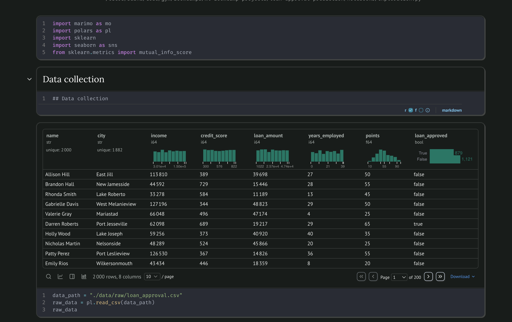

# Loan Approval Predictor

## 1. Problem Statement

This project aims to predict whether a loan application will be **approved or rejected** based on an applicant's demographic, financial, and employment information. 

**Who benefits:** Financial institutions can use this model to streamline their loan approval process, reduce manual review time, and make more consistent decisions. Applicants benefit from faster processing times and clearer understanding of approval factors.

**How the model will be used:** The model serves as a decision-support tool that processes loan applications and provides a binary prediction (approved/rejected) along with a confidence score. It can be integrated into existing loan processing systems via a REST API.

**Why this matters:** Automating initial loan screening can help lenders process applications more efficiently while maintaining fair and consistent evaluation criteria. This reduces operational costs and improves customer experience through faster turnaround times.

## 2. Dataset Description



**Source:** [Kaggle - Loan Approval Dataset](https://www.kaggle.com/datasets/anishdevedward/loan-approval-dataset/data)

**Overview:** The dataset contains 2,000 simulated loan applications with the following characteristics:

- **Target Variable:** `loan_approved` (True/False)
- **Features Include:**
  - Financial: Income, existing loans, credit score
  - Employment: Employment status, years employed

**Data Quality:**

- Size: 2,000 records (manageable for quick iteration)
- Missing values: None
- Class balance: 879 (43.95%) positive, 1121 (56.05%) negative

## 3. EDA Summary

Key findings from exploratory data analysis:

- **Income Distribution:** Highly skewed with most applicants earning between 30K-130K, with some high earners up to 1.5M
- **Credit Score Range:** Spans from 300 to 822, with typical range around 300-822
- **Loan Amounts:** Requested amounts range from ~1,000 to 74,000+
- **Employment Tenure:** Varies from 0 to 39 years
- **Geographic Distribution:** 1,882 unique cities represented
- **Approval Rate:** 43.95%

**Feature Engineering:**

- Dropped `name` and `city` column (not predictive)

Could also do:

- Created `debt_to_income_ratio`: loan_amount / income
- Binned `credit_score` into categories (Poor/Fair/Good/Excellent)

**Visualizations:** See `notebooks/exploration.py` for detailed plots and analysis.

## 4. Modeling Approach & Metrics

**Baseline Model:** Logistic Regression

- Chosen for its interpretability and efficiency
- Provides probability scores useful for risk assessment
- Coefficients reveal feature importance for business insights

**Model Training:**

- Train/validation/test split: 60/20/20
- Cross-validation: 5-fold CV on training set
- Hyperparameter tuning: Regularization strength (C parameter)

**Evaluation Metric:** 

- **Primary:** AUC-ROC (measures ability to distinguish between classes)
- **Secondary:** Precision and Recall (important for understanding false positives vs false negatives in loan context)

**Results:**

| Model              | AUC-ROC | Precision | Recall | Accuracy |
|--------------------|---------|-----------|--------|----------|
| Logistic Regression| 0.84    | 0.84      | 0.83   | 0.83     |

**API Implementation:** FastAPI with automatic OpenAPI documentation

## 5. How to Run Locally

### Prerequisites

- Python 3.11+
- uv (recommended) or pip

### Setup

```bash
# Clone the repository
git clone git@github.com:jhumigas/loan_approval_predictor.git

cd loan-approval-predictor

# Dataset is already download in the repository

# Install uv if you haven't already
curl -LsSf https://astral.sh/uv/install.sh | sh

# Install dependencies using uv
uv sync

# Train the model
make train-model

# Run predictions for sample data
make test-predict
```

If you want to view the notebook for EDA and modelling see here:

```bash
marimo edit notebooks/exploration.py
```

### Start the Web Service

```bash
make start-app
```

The API will be available at `http://localhost:8000`

You can also access the interactive API docs at `http://localhost:8000/docs`

## 6. Running with Docker

### Build the Docker Image

```bash
make docker-build
```

### Run the Container

```bash
make docker-run
```

The service will be accessible at:
- API: `http://localhost:9696`
- Interactive docs: `http://localhost:9696/docs`


### Make a Prediction

```bash
curl -X POST http://localhost:9696/predict \
  -H "Content-Type: application/json" \
  -d '{
    "income": 62098,
    "credit_score": 689,
    "loan_amount": 19217,
    "years_employed": 29,
    "points": 65
}'
```

**Response:**

```json
{
  "loan_approved": true,
  "probability": 0.86
}
```

**Note:** The `name` field is not required for prediction as it's not used in the model.

## 8. Project Structure

```text
loan-approval-predictor/
│
├── data/
|   ├── samples                # Sample data for local experimentations
│   └── raw/                   # Raw data
│
├── notebooks/
│   └── exploration.py         # Model development, with EDA 
│
├── scripts/
|   ├── train.py               # Training script
│   └── predict.py             # Prediction script for local testing
|
├── src
│   └── loan_approval_predictor
│       ├── config.py          # Configuration module to load variables, parameters
│       ├── predict.py         # Prediction module 
│       ├── serve.py           # Fast API entrypoint 
│       └── train.py           # Train and model artifacts saving 
│
├── models                     # Model artifacts
│
├── tests                      # Tests
│
├── config.toml                # Project configurations such as data path, random seed, etc
├── pyproject.toml             # uv project configuration
├── uv.lock                    # Locked dependencies
├── Dockerfile
├── README.md
└── .gitignore
```

## 9. Architecture Diagram

```
┌─────────────┐
│   Raw Data  │
│  (CSV/JSON) │
└──────┬──────┘
       │
       ▼
┌─────────────┐
│     EDA     │
│  & Cleaning │
└──────┬──────┘
       │
       ▼
┌─────────────┐
│   Feature   │
│ Engineering │
└──────┬──────┘
       │
       ▼
┌─────────────┐
│   Logistic  │
│ Regression  │
│   Training  │
└──────┬──────┘
       │
       ▼
┌─────────────┐
│   Model     │
│  Artifact   │
│  (.bin)     │
└──────┬──────┘
       │
       ▼
┌─────────────┐
│  Fast API  │
│   Service   │
└──────┬──────┘
       │
       ▼
┌─────────────┐
│  Prediction │
│   Response  │
└─────────────┘
```

## 10. Known Limitations & Next Steps

**Current Limitations:**

- Model trained on simulated data; real-world performance may vary
- Does not account for macroeconomic factors (interest rates, market conditions)
- Binary classification only (no risk scoring tiers)

**Future Improvements:**

- Experiment with ensemble methods (Random Forest, XGBoost) for potentially better performance
- Add explainability features (SHAP values) to show why loans were approved/rejected

## 11. Dependencies

This project uses **uv** for fast, reliable dependency management.

**Key files:**

- `pyproject.toml` - Project metadata and dependencies
- `uv.lock` - Locked dependency versions for reproducibility

**Main libraries:**

- fastapi - Modern web framework for building APIs
- uvicorn - ASGI server for FastAPI
- polars - Data manipulation
- scikit-learn - Machine learning
- numpy - Numerical computing
- pydantic - Data validation

To view all dependencies:

```bash
uv tree
```

## 12. Model Performance Notes

- The model performs best on applications within typical income ranges
- Edge cases (very high/low income) may require additional validation
- Regular retraining recommended as loan approval patterns evolve